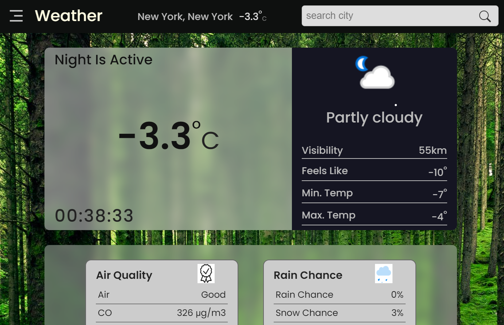

# Weather Forecast

## Description
This is a simple weather website that provides users with current weather information for a specified location. It uses "Weather API" to fetch weather data and displays it in a user-friendly interface.

## Features

### 1. Current Weather
### 2. Hourly Weather
### 3. Forecast Weather
### 4. Future Weather
### 5. History Weather
### 6. Auto complete Cities
### 7. Responsive

## Build with
- React
- Java Script
- CSS
- HTML

## Getting Started
1. Visit [https://weather.karansencha.com/](https://weather.karansencha.com/).
2. Enter desired city in search box and enter.
3. Optional: Click which weather you want like current, forecast, history and much more.

## Feedback and Support
Your feedback is valuable! If you encounter any issues or have suggestions for improvement, please [contact us](mailto:karanenquiry1@gmail.com).

## Developer
- **Developer:** [Karan Sencha](https://karansencha.com/)
- **Contact:** [karanenquiry1@gmail.com](mailto:karanenquiry1@gmail.com)

## Acknowledgments
- [Weather API](https://www.weatherapi.com/) for providing the weather data API.
- moment-timezone for timezone setup